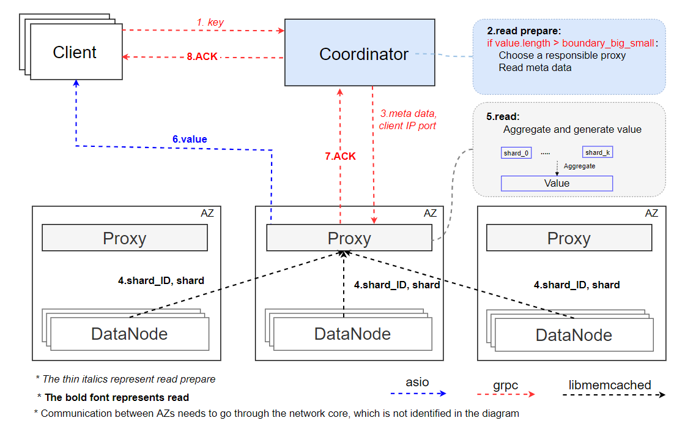

## 用户接口
该原型系统提供给用户以下接口
 - set(key, value)
 - get(key)
 - update(key, part_value, offset, len) // 这里的offset是指更新起始位置相对于对象起始位置的偏移量
 - delete(key)
## 原型系统主要流程
* 写流程
	* 大文件写
	* 小文件写
* 读流程
	* 大文件读
	* 小文件读
* 修复流程
* 更新流程
### 写流程
#### 大文件写：
1. client调用set(key, value)启动写流程，首先，client将写命令和key，value.length发送给coordinator
2. coordinator收到client的key和value.length,coordinator需要完成的步骤如下：
	* 通过value.length长度判断需要读取的是大文件
	* 选择一个Proxy负责数据切分和编码过程
	* 生成条带的放置策略，并将放置策略通知Proxy，让Proxy做好接收数据的准备
	* 更新coordinator中的元数据信息，元数据信息需要存储该key键值对编码的条带信息和放置信息。
	* 将被选择的Proxy的IP地址通知client
3. client收到coordinator发来的Proxy地址后，向该Proxy发送数据
4. Proxy收到数据后，将数据切分编码为条带（stripe)，按照coordinator生成的放置策略将条带中的各个块(shard)放置在相应的存储节点，Proxy在存储完成后，向coordinator返回ACK/NoACK, coordinator正式提交/回滚元数据信息。

### 读流程
#### 大文件读：
1. client调用get(key)启动读流程，client将读命令和key发送给coordinator
2. coordinator收到来自client的key，需要完成的步骤如下：
	* 读取元数据信息，通过value.length长度判断需要读取的是大文件
	* 通过读取元数据信息获取大文件的元数据信息：stripe和shard信息，获取每个shard所在的datanode的IP
	* coordinator选择一个proxy来负责读取数据并拼接，coordinator将元数据和client的IP发给该proxy
3. 被选中的proxy读取组成大文件的shard并拼接在一起：
	* 如果读取成功，向coordinator发送ACK,proxy将拼接的数据发送给client
	* 如果读取失败，向coordinator发送NoACK,coordinator启动修复流程，将修复之后的数据发送给client

## 修复流程
 1. 每个proxy都会与其所在AZ的所有DataNode保持心跳，以检测AZ内DataNode是否失效
 2. 若proxy检测到某个或某些DataNode失效，向coordinator发送repair请求，告知coordinator哪些DataNode失效了
 3. coordinator查询有哪些shard损坏，针对每个shard生成修复方案
	 - 若某些shard属于同一条带，则这些shard共用同一个修复方案
 4. coordinator把触发repair流程的proxy指定为main proxy，另外再选择若干其它AZ的proxy作为help proxy
 5. coordinator向main proxy发送main repair request
	 - 在request中，coordinator会告诉main proxy需要在本AZ内的哪些DataNode上读取哪些shard
	 - 还会告诉main proxy是否采用partial decoding策略以及help proxy的地址
	 - main proxy在本AZ内读取完所需数据，并且接受完所有help proxy的数据后，执行纠删码解码操作，恢复原始数据
	 - 将恢复后的shard放置到coordinator指定的DataNode
	 - 向coordinator返回ack
 6. coordinator向help proxy发送help repair request
	 - 在request中，coordinator会告诉help proxy需要在本AZ内的哪些DataNode上读取哪些shard
	 - 还会告诉help proxy是否采用partial decoding策略以及main proxy的地址
	 - help proxy在本AZ内读取完所需数据后，根据是否采用partial decoding策略，选择是否执行聚合操作
	 - help proxy将最终的数据发送给指定的main proxy
	 - 向coordinator返回ack
 7. coordinator在收到help proxy与main proxy的ack后，结束修复流程。
 
## 更新流程
接口：update(key,offset,lenthg,new_data)
>offset为新内容在文件中的偏移量
>大小文件的更新是统一的
1. client给coordinator发送prepare(key,offset,length)指令，以获得接收新数据的proxy信息。
2. coordinator根据prepare指令中的参数：key,offset,length，计算出相关条带、数据shard、校验块shard，以及所在节点等信息，给它们所在AZ的proxy发送信息进行通知。
   * 通知的信息包括：更新的条带,更新的shard，新数据在shard中的偏移和长度，相关shard所在节点的地址，相关proxy地址，以及用来计算校验块的系数。即：
   * stripe_id,shard_idxoffset,length,node_ip，proxy_ip，计算校验块的系数。
   >proxy分两种：datap_roxy,collector_proxy。data_proxy为有数据数据块更新的proxy，collector_proxy为含有相关全局校验块的proxy。
3. coordinator等所有proxy返回ACK，给client返回接收新数据的proxy信息，以及client给proxy发送数据的格式
4. client根据coordinator的回应，将新数据发送给proxy。
5. data_proxy接收数据,给client返回ACK信息。读取旧数据并计算出data_delta。
6. data_proxy将data_delta发送给collector_proxy。
7. 对于全局校验块，collector_proxy接受data_delta并返回ACK，计算出parity_delta，存在日志中。对于局部校验块，各相关proxy使用data_delta计算出parity_delta，写入日志中。
   >每个节点写日志会记录更新的条带与shard，parity_delta的在shard中的偏移量以及长度。
8. 在所有的校验块成功写入信息后，collector_proxy给data_proxy返回校验块更新成功的信息。
9.  data_proxy将新数据写入。
10. data_proxy给coordinator返回更新成功的消息。
11. coordinator给client返回更新成功的信息。

## 待解决问题
1. 删除流程，存在条带重组的问题
2. 更新流程中，2PC带来的可用性降低的问题