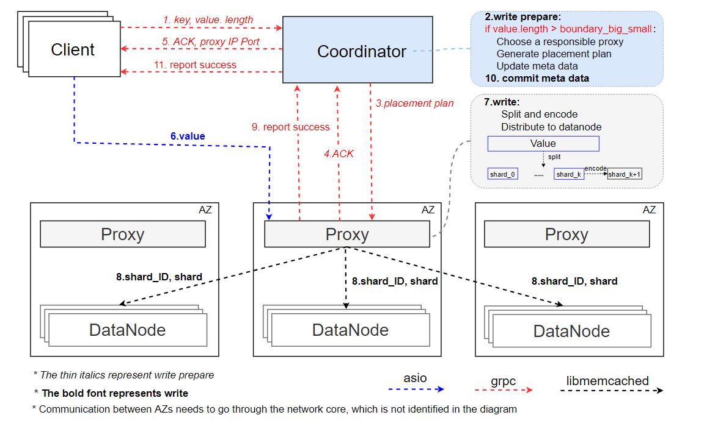
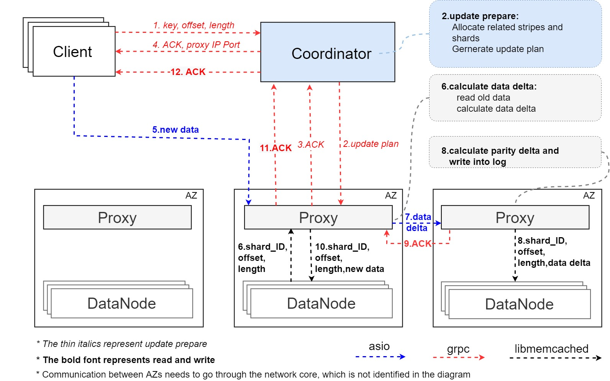

## 用户接口
该原型系统提供给用户以下接口
 - set(key, value)
 - get(key)
 - repair(failed_nodes_list)
 - update(key,offset,lenth,new_data) // 这里的offset是指更新起始位置相对于对象起始位置的偏移量
 - delete(key)

## libmemcached和memcached的使用
- 我们虽然在原型系统中使用了libmemcached和memcached这两个开源软件，但我们的读、写、修复流程并没有依赖于它们。
- memcached是一个单机kv内存存储引擎，我们通过它的读写接口来简化原型系统中数据读取和存储的实现。libmemcached是专为memcached开发的客户端，我们通过它来远程管理若干个memcached实例，使得我们无需再编写一套通信协议去远程访问memcached。
- 使用这两个开源软件的主要目的仅仅是为了简化开发流程、降低实现难度，我们的条带放置策略、小文件读写策略、更新策略都不会依赖它们，它们也没有为我们的设计提供特殊的支持，所以这对后续的迁移工作不会造成影响。
## 原型系统主要流程
* 写流程
	* 大文件写
	* 小文件写
* 读流程
	* 大文件读
	* 小文件读
* 修复流程
* 更新流程
### 写流程
#### 大文件写：
1. client调用set(key, value)启动写流程，首先，client将写命令和key，value.length发送给coordinator

2. coordinator收到client的key和value.length,coordinator需要完成的步骤如下：
	* 通过value.length长度判断需要读取的是大文件
	* 选择一个Proxy负责数据切分和编码过程
	* 生成条带的放置策略，并将放置策略通知Proxy，让Proxy做好接收数据的准备
	* 更新coordinator中的元数据信息，元数据信息需要存储该key键值对编码的条带信息和放置信息。
	* 将被选择的Proxy的IP地址通知client
	
3. client收到coordinator发来的Proxy地址后，向该Proxy发送数据

4. Proxy收到数据后，将数据切分编码为条带（stripe)，按照coordinator生成的放置策略将条带中的各个块(shard)放置在相应的存储节点，Proxy在存储完成后，向coordinator返回ACK/NoACK, coordinator正式提交元数据信息。如果存在写成功部分节点的情况，采用cubefs已有的巡检机制启动恢复流程。
    
####  小对象写流程

由于小对象采用了`Cross-Coding`的编码策略，因此其条带编码操作将在多个写请求之后执行。为此，我们在 Proxy 节点中维护了 $k$ 个 Buffer 以暂存未被编码的小对象，同时预设了一个 Buffer - Node 的映射关系，在 Buffer 填满组成条带之后，便将 Buffer 内的数据直接写入映射所对应的存储节点中。

* Client 向 Coordinator 发送 SET 预备请求。
  * 传递信息： 对象的 Key 与 Length。
* Coordinator 通过分析对象大小以及目前 Buffer 暂存情况，做出以下操作：
  * 若还有可用 Buffer ，则直接向 Proxy 发送可用 Buffer 的 ID 信息。
  * 若无可用 Buffer , 则根据集群存储情况生成新的条带放置策略，同时维护新的 Buffer - Node 映射，随后向 Proxy 发送新的映射以及 Buffer ID (默认0)，同时指示 Proxy 对 旧的 Buffer 数据进行编码操作。
* Proxy 收到 Coordinator 的暂存 Buffer ID, 返回 ACK。
  * 若同时收到编码指示，则开始异步地生成条带，并写入旧映射关系对应的数据节点。
* Coordinator 收到 ACK 后，向 Client 发送对应的 Proxy  Node IP。
* Client 收到 Node IP 后，向对应的代理节点发送 SET 请求以及对象数据。
* Proxy 将收到的对象数据暂存于 Buffer 中，随后返回 ACK 。
* Client 收到 ACK, 写流程视为结束。 

### 读流程
#### 大文件读：
1. client调用get(key)启动读流程，client将读命令和key发送给coordinator
2. coordinator收到来自client的key，需要完成的步骤如下：
	* 读取元数据信息，通过value.length长度判断需要读取的是大文件
	* 通过读取元数据信息获取大文件的元数据信息：stripe和shard信息，获取每个shard所在的datanode的IP
	* coordinator选择一个proxy来负责读取数据并拼接，coordinator将元数据和client的IP发给该proxy
3. 被选中的proxy读取组成大文件的shard并拼接在一起：
	* 同时读取k+g个块，取最先到达的k个块，进行拼接或解码。
	* 拼接或解码完成，向coordinator发送ACK,proxy将拼接的数据发送给client

#### 小对象读流程

*  Client 向 Coordinator 发送 GET 请求。
     * 传递信息：对象的 Key。
*  Coordinator 通过查询元数据后，向 Proxy 发送小对象的位置信息。
     * 传递信息：Shard_ID , Offset , Length。
     * 其中 Offset, Length 通过直接查询对象索引获得，Shard_ID 通过对象索引中的 Stripe_ID 与 Shard_idx 间接获得。
* Proxy 对 Data Node 进行一次询问，判别小对象所在的存储区域是否可访问。
    * 若不可访问，则返回 ERROR 信息，后续将触发降级读流程。
    * 若可正常访问，则进行数据访问。
* Proxy 根据先前的元数据信息对对应数据节点进行数据访问，并在得到数据后将其返回给 Client，同时向 Coordinator 发送ACK 。
* Client 收到对象数据，流程结束。

#### 小对象降级读流程

*  Client 向 Coordinator 发送 GET 预备请求。
   
   * 传递信息：对象的 Key。
*  Coordinator 通过查询元数据后，向 Proxy 发送小对象的位置信息。
   * 传递信息：Shard_ID , Offset , Length。
   * 其中 Offset, Length 通过直接查询对象索引获得，Shard_ID 通过对象索引中的 Stripe_ID 与 Shard_idx 间接获得。
*  Proxy 对 Data Node 进行一次询问，判别小对象所在的存储区域是否可访问。
   * 若不可访问，则返回 ERROR 信息，后续将触发降级读流程(此流程路径与修复流程一致)。
   * 若可正常访问，则返回 ACK。
*  Coordinator 收到 ERROR 信息后，向 Proxy 发送修复所需的元数据信息，同时向 Client 返回 Proxy Node IP。
   *  此处的 ERROR 信息包括 Shard ID 。
   *  元数据信息包括但不限于与 ERROR Shard ID 处于同一条带的存活 Shard ID 信息。
   *  在小对象情形下，Coordinator 还将查询所有存活 Shard 的索引，以找到与 Client 的请求对象在 Shard 内偏移量对齐的所有对象。
   *  最终 Coordinator 还将为发送的存活 Shard ID 信息后附上 Offset + Length，以减少降级读时的读放大问题。

* Proxy 对优先收到的足量数据进行解码操作，同时根据偏移量与对象大小等信息对解码出的数据进行截取，随后向 Client 返回对象数据，同时向 Coordinator 反送ACK，告知解码结束。

* Client 收到 Coordinator 的ACK 以及Proxy传来的对象数据后，流程结束。

> $p.s.$ 1.当前版本先不考虑副本中间态；2.在条带生成之前的数据容错，由back-up Proxy以副本形式提供.

## 修复流程
- 我们这里采用的是手动kill掉一个或若干DataNode来模拟节点宕机的情况，并在Client节点调用repair(failed_nodes_list)接口主动触发修复流程。
- 在这里我们不做节点活性判断和错误检测，因为这不是原型系统关注的重点。
- 在后续迁移过程中，我们可以利用cubefs节点间的心跳机制来做错误检测。
 1. client告知coordinator有哪些节点损坏
 2. coordinator查询有哪些shard损坏，针对每个shard生成修复方案
	 - 若某些shard属于同一条带，则这些shard共用同一个修复方案
 3. 针对每个条带，coordinator会指定某个proxy为main proxy，另外再选择若干其它AZ的proxy作为help proxy
 4. coordinator向main proxy发送main repair request
	 - 在request中，coordinator会告诉main proxy需要在本AZ内的哪些DataNode上读取哪些shard
	 - 还会告诉main proxy是否采用partial decoding策略以及help proxy的地址
	 - main proxy在本AZ内读取完所需数据，并且接受完所有help proxy的数据后，执行纠删码解码操作，恢复原始数据
	 - 将恢复后的shard放置到coordinator指定的DataNode
	 - 向coordinator返回ack
 5. coordinator向help proxy发送help repair request
	 - 在request中，coordinator会告诉help proxy需要在本AZ内的哪些DataNode上读取哪些shard
	 - 还会告诉help proxy是否采用partial decoding策略以及main proxy的地址
	 - help proxy在本AZ内读取完所需数据后，根据是否采用partial decoding策略，选择是否执行聚合操作
	 - help proxy将最终的数据发送给指定的main proxy
	 - 向coordinator返回ack
 6. coordinator在收到help proxy与main proxy的ack后，向client返回ack，结束修复流程。
 
## 更新流程
接口：update(key,offset,lenth,new_data)
>offset为新内容在文件中的偏移量
>大小文件的更新是统一的
1. client给coordinator发送prepare(key,offset,length)指令，以获得接收新数据的proxy信息。
2. coordinator根据prepare指令中的参数：key,offset,length，计算出相关条带、数据shard、校验块shard，以及所在节点等信息，给它们所在AZ的proxy发送信息进行通知。
   * 通知的信息包括：更新的条带,更新的shard，新数据在shard中的偏移和长度，相关shard所在节点的地址，相关proxy地址，以及用来计算校验块的系数。即：
   * stripe_id,shard_idx,offset,length,node_ip，proxy_ip，计算校验块的系数。
   >proxy分两种：data_proxy,collector_proxy。data_proxy为有数据数据块更新的proxy，collector_proxy为含有相关全局校验块的proxy。
3. coordinator等所有proxy返回ACK，给client返回接收新数据的proxy信息，以及client给proxy发送数据的格式
4. client根据coordinator的回应，将新数据发送给proxy。
5. data_proxy接收数据,给client返回ACK信息。读取旧数据并计算出data_delta。
6. data_proxy将data_delta发送给collector_proxy。
7. 对于全局校验块，collector_proxy接受data_delta并返回ACK，计算出parity_delta，存在日志中。对于局部校验块，各相关proxy使用data_delta计算出parity_delta，写入日志中。
   
   >每个节点写日志会记录更新的条带与shard，parity_delta在shard中的偏移量以及长度。
8. 在所有的校验块成功写入信息后，collector_proxy给data_proxy返回校验块更新成功的信息。
9.  data_proxy将新数据写入。
10. data_proxy给coordinator返回更新成功的消息。
11. coordinator给client返回更新成功的信息。

## 待解决问题
1. 删除流程，存在条带重组的问题
2. 更新流程，2PC带来的可用性降低的问题
