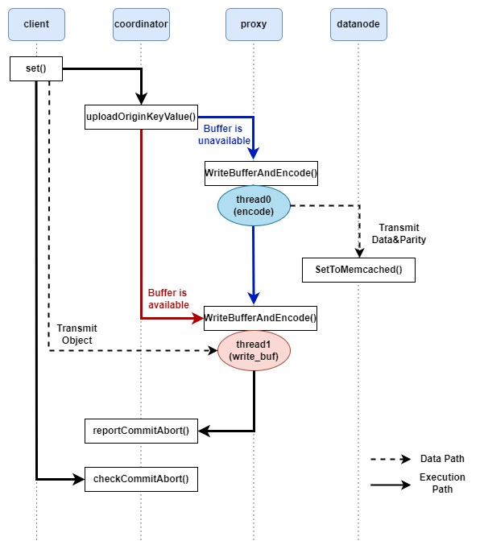
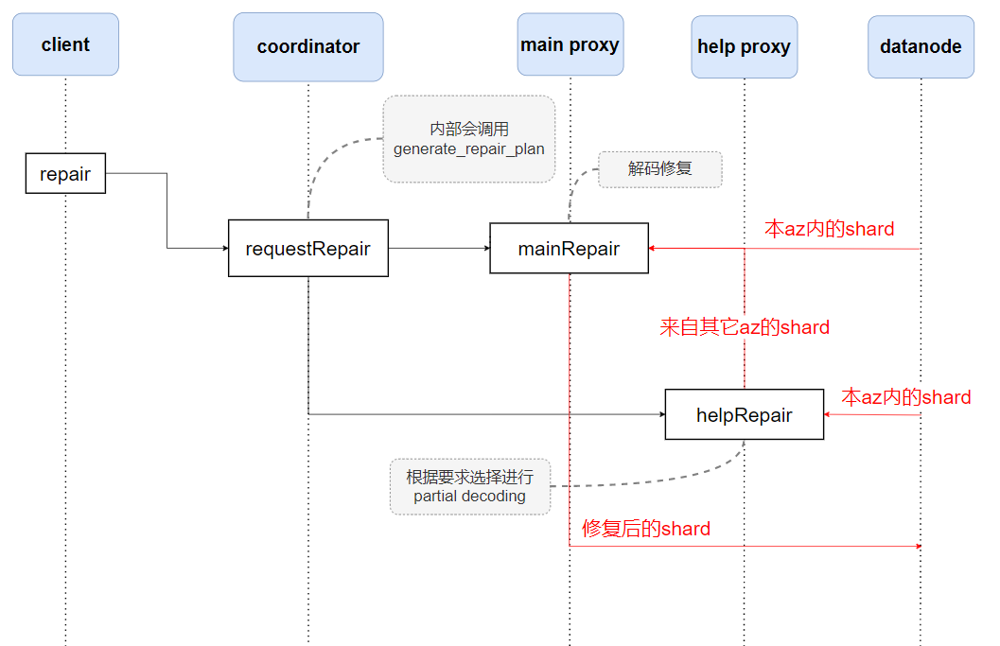

# 重要源文件

### 1. client.h/cpp
client通过set和get两个接口来存储数据和读取数据。
```c
/*
	步骤：
	     1）调用uploadOriginKeyValue；
	     2）向指定的proxy节点发送value；
	     3）向coordinator询问value是否已经成功存储到datanode上；
*/
bool Client::set(std::string key, std::string value)
```
```c
/*
	步骤：
	     1）调用getValue；
	     2）阻塞等待接收proxy发来的数据；
*/
bool Client::get(std::string key, std::string &value)
```
```c
/*
	步骤：
	     1）调用requestRepair；
	     2）完成requestRepair远程调用后立即返回；
*/
bool Client::repair(std::vector<std::string> failed_node_list)
```


### 2. coordinator.h/cpp
coordinator中的实现函数基本都是rpc，由其它节点远程调用。
```c
/* 
   调用节点：client
   执行节点：coordinator
   rpc参数：k、l、g、编码策略、放置策略、blob上限、小文件上限的系统参数
   rpc返回值：bool值，指示系统参数是否设置成功
   作用：在coordinator中设置各种系统参数。
   备注：在client进程启动时便会调用。
*/
grpc::Status CoordinatorImpl::setParameter(::grpc::ServerContext *context, const coordinator_proto::Parameter *parameter, coordinator_proto::RepIfSetParaSucess *setParameterReply)
```
```c
/* 
   调用节点：client
   执行节点：coordinator
   rpc参数：key，value大小
   rpc返回值：proxy的ip和端口号
   作用：在coordinator中为key对应的对象构造并保存相应的元数据信息，生成该对象数据的放置策略，
        指定一个proxy节点做好接收数据的准备工作，并向client返回该proxy节点的地址。
*/
grpc::Status CoordinatorImpl::uploadOriginKeyValue(::grpc::ServerContext *context, const coordinator_proto::RequestProxyIPPort *keyValueSize, coordinator_proto::ReplyProxyIPPort *proxyIPPort)
```
```c
/* 
   调用节点：client
   执行节点：coordinator
   rpc参数：key，client的ip和端口号
   rpc返回值：读取到的数据的大小
   作用：根据key，coordinator将一些必要的元数据信息发送给某一proxy节点，
        指示该proxy从datanode读取数据并发送给client。
*/
grpc::Status CoordinatorImpl::getValue(::grpc::ServerContext *context, const coordinator_proto::KeyAndClientIP *keyClient, coordinator_proto::RepIfGetSucess *getReplyClient)
```

```c
/* 
   调用节点：client
   执行节点：coordinator
   rpc参数：key
   rpc返回值：数据存储结果
   作用：client向coordinator查询，本次set操作中，key对应的对象数据是否已经成功存储到了datanode中。
*/
grpc::Status CoordinatorImpl::checkCommitAbort(grpc::ServerContext *context, const coordinator_proto::AskIfSetSucess *key, coordinator_proto::RepIfSetSucess *reply)
```

```c
/* 
   调用节点：proxy
   执行节点：coordinator
   rpc参数：key，数据存储结果
   rpc返回值：无
   作用：proxy告知coordinator，key所对应的对象的数据是否都已经完全存储到了datanode中。
*/
grpc::Status CoordinatorImpl::reportCommitAbort(::grpc::ServerContext *context, const coordinator_proto::CommitAbortKey *commit_abortkey, coordinator_proto::ReplyFromCoordinator *helloReplyFromCoordinator)
```
```c
// 根据预先设定的编码策略、编码参数、放置策略等条件，为每个条带生成具体的放置方案。
void CoordinatorImpl::generate_placement(std::vector<unsigned int> &stripe_nodes)
```

```c
/* 
   调用节点：client
   执行节点：coordinator
   rpc参数：损坏节点的ip地址
   rpc返回值：bool值，修复是否成功
   作用：根据损坏的节点确定有哪些stripe损坏，针对每个stripe生成相应的repair plan；
         repair plan会确定main az、help az以及实际的修复计划；
         coordinator指示main proxy执行mainRepair操作，指示help az执行helpRepair操作，从而修复数据。
*/
grpc::Status CoordinatorImpl::requestRepair(::grpc::ServerContext *context, const coordinator_proto::FailNodes *failed_node_list, coordinator_proto::RepIfRepairSucess *reply)
```

```c
// 根据预先设定的编码策略、编码参数以及条带的放置情况等条件，为每个条带生成具体的修复方案
void CoordinatorImpl::generate_repair_plan(int stripe_id, bool one_shard, std::vector<int> &failed_shard_idxs, std::vector<std::vector<std::pair<std::pair<std::string, int>, int>>> &shards_to_read, std::vector<int> &repair_span_az, std::vector<std::pair<int, int>> &new_locations_with_shard_idx)
```

### 3. proxy.h/cpp
proxy主要由2个rpc调用实现自身的功能。
```c
/* 
   调用节点：coordinator
   执行节点：proxy
   rpc参数：各种系统参数以及实际的放置方案
   rpc返回值：无
   作用：在proxy中启动1个异步线程，然后该rpc调用就立刻结束返回，
        新启动的线程会等待client发送过来的数据，当接收到client的数据后，
        根据coordinator给出的各种系统参数，对数据进行切片、编码等操作，
        最后根据coordinator给出的放置方案将数据块和校验块存储到datanode中。
*/
grpc::Status ProxyImpl::EncodeAndSetObject(grpc::ServerContext *context, const proxy_proto::ObjectAndPlacement *object_and_placement, proxy_proto::SetReply *response)
```
```c
/* 
   调用节点：coordinator
   执行节点：proxy
   rpc参数：各种系统参数以及实际的放置方案
   rpc返回值：无
   作用：proxy中维护一个缓存来存储客户端发送的小对象数据。
        该函数根据缓存的存储情况将进入不同分支，每个分支都将启动1个异步线程，
        然后该rpc调用就立刻结束返回。函数的两个分支内容与触发条件如下：
      （1）当缓存区不足以暂存新的对象时，函数将启动编码线程，对缓存区内的数据
        进行切片，编码等操作，最后根据放置方案将数据块和校验块存储到datanode中。
      （2）当缓存区充足时，函数将启动数据接收线程，将客户端传入的对象数据暂存
        在缓存区中，随后执行reportCommitAbort函数，告知客户端对象已写入。
*/
grpc::Status ProxyImpl::WriteBufferAndEncode(grpc::ServerContext *context, const proxy_proto::ObjectAndPlacement *object_and_placement, proxy_proto::SetReply *response)
```
```c
/* 
   调用节点：coordinator
   执行节点：proxy
   rpc参数：各种系统参数、实际的放置方案以及client的ip和端口号
   rpc返回值：无
   作用：在proxy中启动1个异步线程，然后该rpc调用就立刻结束返回，
        新启动的线程会从datanode中读取各个块并解码合并得到原始数据
        将数据发送给client。
*/
grpc::Status ProxyImpl::decodeAndGetObject(grpc::ServerContext *context, const proxy_proto::ObjectAndPlacement *object_and_placement, proxy_proto::GetReply *response)
```

```c
/* 
   调用节点：coordinator
   执行节点：proxy
   rpc参数：与修复相关的各种参数，修复后的shard应该放置的节点地址
   rpc返回值：无
   作用：从本az内部读取必要的shard，如果存在help az，需要阻塞等待help az发送shard；
        当必要的shard都读取完毕后，解码修复；
        最后将新修复的shard写到指定位置。
*/
grpc::Status ProxyImpl::mainRepair(grpc::ServerContext *context, const proxy_proto::mainRepairPlan *mainRepairPlan, proxy_proto::mainRepairReply *reply)
```

```c
/* 
   调用节点：coordinator
   执行节点：proxy
   rpc参数：与修复相关的各种参数
   rpc返回值：无
   作用：从本az内部读取必要的shard；
        根据要求决定是否进行partial decoding操作；
        将shard发送给指定的main proxy。
*/
grpc::Status ProxyImpl::helpRepair(grpc::ServerContext *context, const proxy_proto::helpRepairPlan *helpRepairPlan, proxy_proto::helpRepairReply *reply)
```

### 4. datanode.h/cpp
datanode很简单，只有1个do_work函数，其作用就是阻塞等待来自proxy的读写数据请求。
```c
void DataNode::do_work()
```
# 函数调用关系
### 1. 大文件读

### 2. 大文件写

### 3. 小文件写

### 4. 修复
