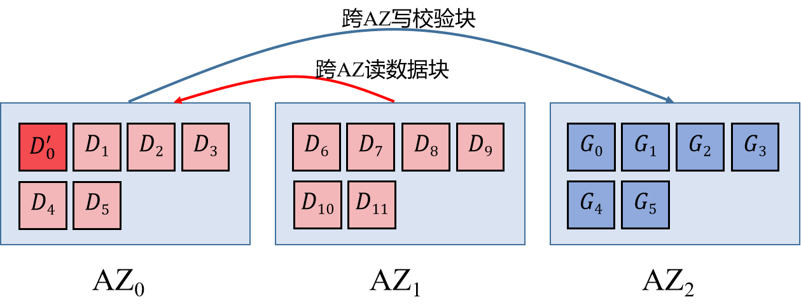
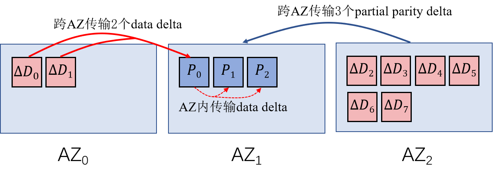
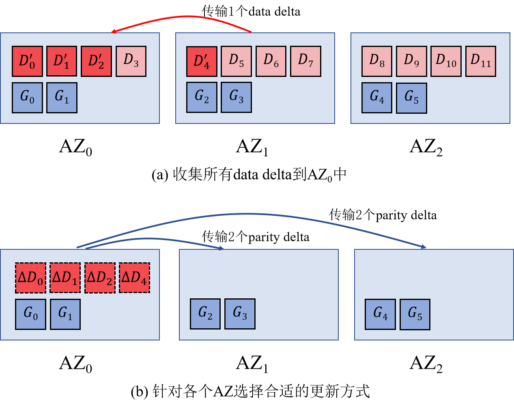
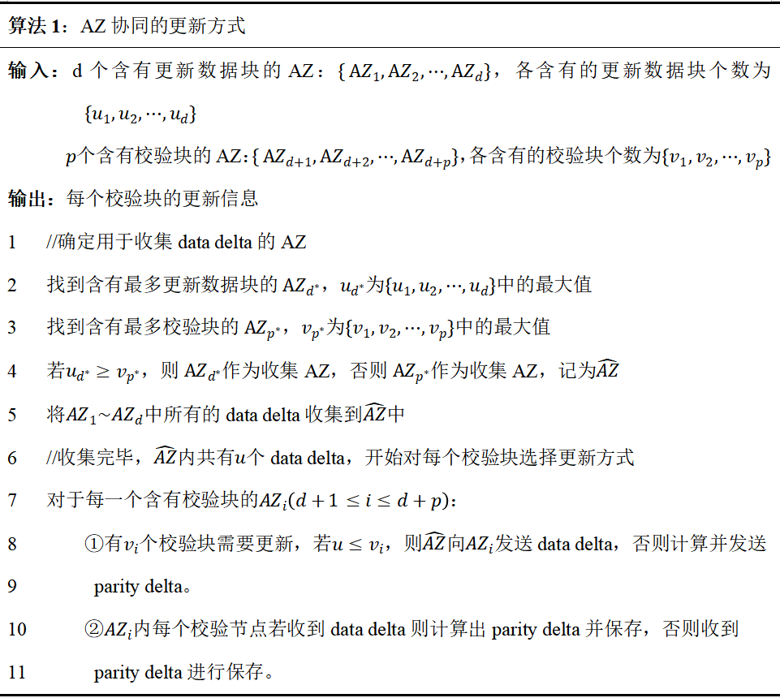

# 一、修复

# 1. 问题描述与分析

## 1.1. cubefs正在使用的编码模式

- **1AZ场景：**RS(10, 4)，冗余度为1.4， 对比三副本节约一半以上的存储成本，并且可以提供大于99.999999999%的数据耐久度。

- **3AZ场景：**

  -  RS(15, 9) ， 当某个AZ数据完全损坏，剩余16份数据可以正常恢复数据，且还能额外允许1块磁盘损坏 。

  

  -  LRC(12, 9, 3)，在AZ故障后可以额外允许任意2份数据损坏，但是其存储冗余度是2.0相对较高。

  

  -  LRC(12, 6, 3)，AZ故障后额外允许任意1块磁盘损坏，存储冗余度1.75。

  

## 1.2. cubefs编码模式面临的问题

​		RS编码，即使是单块修复也会引起大量的跨AZ流量。为了解决这个问题，cubefs实现了LRC编码，以减少单块修复的跨AZ流量。具体的做法是：先基于RS编码生成全局校验块，然后将全局校验块和数据块均匀放置到每个AZ，最后在每个AZ内部额外生成1个局部校验块。我们将cubefs的这种LRC编码策略称作OPPO_LRC。OPPO_LRC成功将单块修复的跨AZ流量降为0，但仍存在一些问题。

- （1）多块修复时，需要从每个AZ读取**原始**的数据块和全局校验块，跨AZ流量非常大。
- （2）局部校验块无法参与多块修复流程，因而产生额外的单块修复操作。例如某AZ内，损坏了两个数据块和一个局部校验块，OPPO_LRC需要一次多块修复操作和一次单块修复操作才能修复所有的损坏的块。
- （3）当AZ的数量、k、l、g等参数变化时，OPPO_LRC平均分配的放置方式不一定能确保容错下限。
- （4）当数据块更新时，所有的全局校验块也需要更新，而OPPO_LRC的全局校验块分散在所有的AZ中，更新操作会产生大量的跨AZ流量。

# 2. 解决思路

## 2.1. 基本思路

- 对问题（1），可以采用partial decoding策略解决，在跨AZ传输数据块或校验块以前，提前进行一定计算，减少跨AZ传输的数据量。
- 对问题（2），可以使用Azure_LRC编码模式，在修复过程中，Azure_LRC将局部校验块和全局校验块一视同仁，一次多块修复操作就可以修复所有损坏的块。

- 对问题（3），论文[1]针对Azure_LRC提出了在保证一定容错性前提下的最优放置方案。
- 对问题（4），可以尝试将所有的全局校验块放在同一个AZ中。
- 基于基本思路，可以得到图1.1所示的编码和放置策略。相应的编码矩阵设计在**矩阵设计文档**中有详细描述。

图1.1 Azure_LRC

## 2.2. 思路完善

- **容错能力要求：保证单AZ故障外加一个块故障可修复。**
- 显然，图1.1中的Azure_LRC不满足容错能力要求，且单全局校验块的修复会产生跨AZ流量。
- 为了解决该问题，只需要利用所有的全局校验块再生成一个局部校验块，该局部校验块需要和全局校验块放在同一个AZ中，得到图2.2所示的编码和放置策略，称之为Azure_LRC+1。
- 图2.2所示的编码和放置方案，满足了容错能力要求，也保证了所有的单块修复跨AZ流量是最低的。

图1.2 Azure_LRC+1

## 2.3. 对比OPPO_LRC与Azure_LRC+1的冗余度

- 我们需要确保，在不同参数下，当OPPO_LRC与Azure_LRC+1的容错能力相同时，两者的冗余度也不应该相差过大。
- 假设OPPO_LRC和Azure_LRC+1都使用了最完美的编码矩阵（即满足**矩阵设计文档**中提到的MR性质），且假设在3AZ场景下（cubefs只关注3AZ场景），在保证单AZ故障可修复外加一个块可修复的前提下，对OPPO_LRC与Azure_LRC+1做了比较，结果如图1.3所示。
- 从图1.3可以看到，**在满足容错下限的情况下，两种LRC的冗余度是完全一致的**。

图1.3 OPPO_LRC与Azure_LRC+1

# 3. 具体方案

​		虽然cubefs只关注3AZ场景，但我们还是给出了general parameter的方案。OPPO_LRC的放置策略并不适用于general parameter，因为它将AZ的数量与参数l绑定，当参数g过小的时候，它无法保证容错能力要求。

## 3.1. 编码模式和放置策略

- 编码模式：首先根据编码参数k、l、g精心设计编码矩阵，然后按照Azure_LRC的编码模式同时生成局部校验块和全局校验块（相应的编码矩阵设计在**矩阵设计文档**中有详细描述），最后将所有的全局校验块异或，得到一个额外的局部校验块。
- 放置策略：
  - 数据块组表示若干数据块及其对应的局部校验块，b表示一个数据块组中数据块的数量。
  - 针对数据块组：
    - 当b ≤ g时，按论文[1]的策略放置数据块和相应的局部校验块。
    - 当b > g时，对每个数据块组，以g个块为单位放到不同的AZ中。
  - 将所有的全局校验块以及对应的局部校验块单独放到一个AZ中，如图1.2所示。

## 3.2. 基于partial decoding的多块修复流程

- 如图1.4所示的错误模式。如果采用的是OPPO_LRC且不使用partial decoding策略，需要先进行一次多块修复操作以修复数据块D5，接着还要进行一次单块修复操作以修复L0，期间一共**产生了11个块的跨节点流量（单块修复会产生6个块的跨节点流量）和7个块的跨AZ流量**。

图1.4 OPPO_LRC错误模式举例

- 类似的，如图1.5所示，当Azure_LRC+1出现同样的错误模式，我们采用partial decoding策略来修复它：

  - 从编码矩阵中挑选合适的两行，这两行必须线性无关。其中一行是计算L0的式子，因为L0损坏了，必须借此来修复L0。另一行则是计算某个全局校验块的式子，假设是计算G1的式子。

  

  - 这两行其实就是两个方程，可以通过一定变换，可以将所有损坏的块放在方程的左边，所有存活的块放在方程的右边，以方便后续的修复操作。
  - 现在要做的就是读取存活块，计算并解这两个方程即可。需要读取D0~D4、D6~D11、G1。
  - 解方程所需的一些计算，可以在跨AZ传输之前完成，也可以在跨AZ传输之后完成：
    - 对于AZ1中的D6~D11，其提前计算后，需要跨AZ传输2个块（2个方程），小于原来的6个块，故提前计算。
    - 对于AZ2中的G1，其提前计算后，也需要跨AZ传输2个块（2个方程），多于原来的1个块，故推迟计算。
  - 在得到所需的块后，即可解方程求出损坏的块，整个过程**产生了5个块的跨节点流量和3个块的跨AZ流量**。

图1.4 Azure_LRC+1错误模式举例

# 二、小文件
## 1.问题描述与分析

​		*CubeFS* 基于块存储引擎所设计的 *Self-Coding* 纠删码系统 *BlobStore* , 在面对小对象场景所面临的读写性能问题。

### 1.1. BlobStore 与 Self-Coding

​		*OPPO* 的纠删码系统名为 *BlobStore* ，是一个集成在 *CubeFS* 中的独立键值存储系统。整个 *BlobStore* 的纠删码架构可由图2.1简要表示。在 *OPPO* 的存储集群中，所有可分配空间由多个名为 *Volume* 的逻辑存储单元构成，每个 *Volume* 可支持不同的 *EC* 参数。而每个 *Volume* 由名为 *Chunk* 的基本存储单元组成，其通过唯一的 *Chunk ID* 标识，对应磁盘的一段实际的物理空间。*Chunk* 与 *Volume* 的绑定关系持久化于集群管理器中。在 *BlobStore* 中，用户数据对象将被拆分成单个或多个 *Blob* ,而系统的每次EC计算都将以 *Blob* 为粒度进行。每个 *Blob* 有着全局唯一的 *BID* 作为标识，当 *Blob* 写入 *Volume* 时，系统会将 *Blob* 拆分并计算成多个 *Shard* ，拆分个数由 *Volume* 的参数决定，随后每个 *Shard* 将会对应写到 *Volume* 的每个 *Chunk* 之中。

​																	 图2.1  *BlobStore* 的纠删码框架

​		由此可见，*BlobStore* 是采用单一 *Self-Coding* 模式的纠删码系统，其拥有着条带即文件的特性，在访问时可以享受并行*I/O*带来的高效读写性能。然而在处理小对象时，*Self-Coding* 模式下数据访问时多个*I/O*的启动开销将掩盖并行 *I/O* 的收益，造成读写的性能下降。

### 1.2. OPPO 真实负载分析

​		现在我们简要分析 *OPPO* 真实负载中的对象大小分布，以确定 *BlobStore* 优化小对象存储的必要性。我们以64KB作为大小对象的区分界线，通过分析图2.2所示的存储池负载概况，我们可以发现几点现象：

（1）  *OPPO* 不同存储区域中工作负载的数据分布是有很大差异的。

（2）  小对象并不总是在数目上站主导地位，存在大对象数目占主体的工作场景。

（3）  在多种工作负载中，小对象的存储总量往往是可忽略的。

​	

​															图2.2   *OPPO* 对象存储池负载概况

​	 	根据分析我们不难得出这样的结论：面对普遍存在的大小对象混合场景，单一的 *Self-Coding* 模式不能很好地满足业务对于对象读写的高性能需求。然而由于大对象在存储总量上的主导地位， *BlobStore* 系统原有的纠删码框架需要得到保留。为此，我们需要明确我们的需求，即：

​		 **在原有的Self-Coding框架下，优化小文件纠删码的部署方式，提升系统处理混合对象负载时的I/O性能**。  

## 2.解决思路

​   对于小对象而言，采用先聚集、再编码的 *cross-coding* 模式更为合适。因此我们针对混合对象负载的优化思路便是：**部署混合的编码模式，针对不同大小的对象采用相适应的条带组织形式**。  

​   图2.3展示了混合编码模式下存储系统的条带组织情况。对于客户端写入的大对象（即图示的对象0、1），我们将沿用 *BlobStore* 的编码思路，将对象进行拆分后再编码成相应条带(即图示的 *Stripe 0/1/2* )。而对于客户端写入的大量小对象，我们将采用 *cross-coding* 的编码模式，将足量的小对象聚集成块，随后进行块间的编码生成条带(即图示的 *Stripe 3* )。

​		部署混合的编码模式后，系统在面对混合对象负载时便能分别利用 *self/cross-coding* 的优点，同时优化大对象与小对象的读写性能。

​															   图2.3   混合编码模式示意图

## 3.具体方案

​		将上述思路落实到实现方案中，我们的工作便是：**向仅支持 self-coding 的编码框架内加入 cross-coding 模式**。为此我们需要实现如下两个部分：

* 在条带生成之前实现小对象的暂存与元数据记录。
* 在收集足量小对象之后实现 **异步** 条带编码。

​		我们借助图2.4所示的小对象写流程来展示小文件部分的具体实现方案。

​		在我们的系统中，数据的编码、读写工作将由AZ内的 *Proxy* 服务器负责，而 *Coordinator* 服务器则负责系统任务的调度。为了支持 *cross-coding* 的编码模式，我们将在 *Proxy* 内开辟一块缓存空间来暂存未编码的小对象。当客户端发出关于小对象的写请求后， *Coordinator* 服务器将指示对其进行 *cross-coding* 。随后 *Coordinator* 便会为该小对象在 *proxy* 中寻找可用的缓存区，同时记录该对象的元数据。若 *proxy* 内缓存区均处于饱和状态， *Coordinator*  则会生成缓冲区的编码指令以及新的缓冲区-节点映射(第2步)，并将其传给 *proxy* (第3步)。紧接着，*proxy* 上的缓冲区将 **异步** 地执行编码操作(第4.1步)，随后依照旧的缓冲区-节点映射将缓冲区上的旧数据写入对应的数据节点中(第4.2步)。在编码结束后， *Coordinator*  才会通知客户端将小对象暂存到对应 *proxy* 的已清空缓存区中(第6步)。

​		一言以蔽之，小文件部分的核心工作便是向已有的  *self-coding*  编码框架中加入对象暂存与异步编码模块，进而实现针对小对象的 *cross-coding* 模式，从而达到混合编码的目的。

​																	图2.4   小对象写流程示意图

​		
# 三、更新
# 1. 问题描述
EC更新存在读写放大的问题，更新期间消耗大量跨AZ流量与磁盘I/O。CubeFS采用重构写的更新方式，如图1中12+6的条带，$D_0$更新为$D'_0$，需要读取$AZ_1$中所有未修改数据块，计算出所有校验块后写入到$AZ_2$中，产生大量跨AZ流量。同时数据块和校验块的读取写入导致大量磁盘I/O，降了系统性能。

图1：重构写更新条带

# 2. 解决思路
AZ间可用带宽更为稀缺，在减少跨AZ流量的基础上减少磁盘I/O操作，基于读改写方式更新时使用AZ协同的更新方式减少跨AZ更新流量，使用校验块日志技术减少磁盘I/O。
## 2.1 AZ协同的更新方式
- 重构写与读改写
重构写利用新数据块和所有未修改数据块计算新校验块，需要读取所有未修改数据块。读改写对公式进行优化，只需计算出修改数据块更新前后的差值便可计算出新校验块，考虑条带有$u$个数据块更新，则第$j$个新校验块计算方式为
$$P'_j=P_j+\Delta P=P_j + \Sigma_{i=1}^{u} \alpha_{i}^{j} \Delta D_i$$
- AZ感知更新
基于读改写的方式更新校验块，考虑更新的$u$个数据块分布在$z$个AZ中，第$s$个AZ中有$u_s$个更新数据块，$\Delta P_j$计算方式为
    $$\Delta P_j=\Sigma_{s=1}^{u} \Sigma_{l=1}^{u_s}\alpha_{l}^{j} \Delta D_l  $$
在更新$P_j$时，可以将其他AZ中的data delta跨传输到本AZ内计算parity delta，也可在其他AZ中计算出partial parity delta后传输，AZ感知更新算法选择跨AZ流量更少的方式进行更新。如图2，$AZ_0$给$AZ_1$传输data delta，$AZ_2$给$AZ_1$传输partial parity delta，减少了跨AZ流量。
    

图2：基于AZ感知的选择性更新

- AZ协同的更新方式
将多个AZ中的data delta集中到某些AZ中，在使用partial parity delta更新校验块时可以最大程度聚合data delta，减少跨AZ更新流量。如图3，在（a）中收集data delta到$AZ_0$，在（b）中针对各AZ校验块布局选择合适的更新方式。

图3：AZ协同的更新方式

## 2.2 校验块日志技术（Parity Logging）
基于读改写方式更新校验块时，需要读取旧校验块、计算新校验块、将新校验块写回，引发大量磁盘I/O。考虑在多数情况中条带是完好的，校验块的访问次数远少于数据块访问次数，对校验块的更新无需立即用新校验块覆盖旧校验块，只需在校验节点中记录校验块的更新信息，保证对新数据块提供容错能力。每次更新将更新信息追加到日志中，暂存更新信息，避免了频繁更新校验块的I/O操作，提高更新性能。

# 3. 具体方案
根据条带的更新范围生成跨AZ流量最少的更新方案，若条带中需要更新的数据块较多，重构写跨AZ流量少于AZ协同的更新方式，使用重构写的方式更新校验块；否则使用AZ协同的更新方式更新校验块，使得跨AZ更新流量最少。
## 3.1 AZ协同的更新算法
将更新分为两个阶段，第一阶段选择含有最多更新数据块与最多校验块的AZ数量大的作为收集AZ，收集所有AZ中的data delta，即算法1中1~5行。第二阶段根据收集AZ中data delta的数量与各AZ中校验块的数量选择选择传输data delta或计算出parity delta后传输，即算法1中7~11行，使得更新的跨AZ流量最少。
   

## 3.2 校验块日志技术
在校验节点存放日志，结合AZ协同的更新方式，当有数据块更新时，到达校验节点的更新数据可能是data delta或parity delta，需要记录更新信息类别、条带索引、更新数据块索引、校验块索引等信息，将其追加到日志中，从而减少磁盘I/O。当日志写满或者校验节点接收到合并日志的指令时，将日志中的更新信息与校验块进行合并。