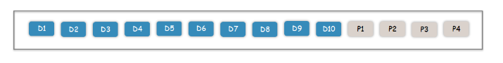
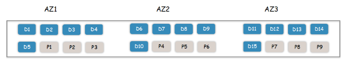
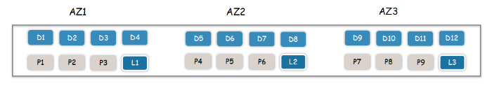
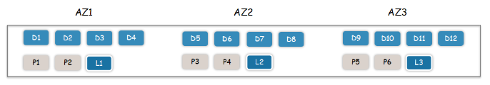
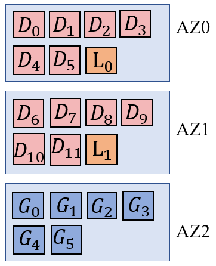
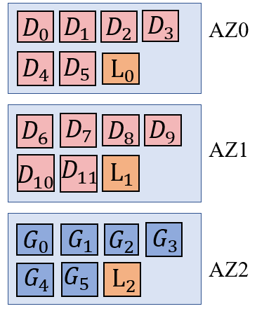
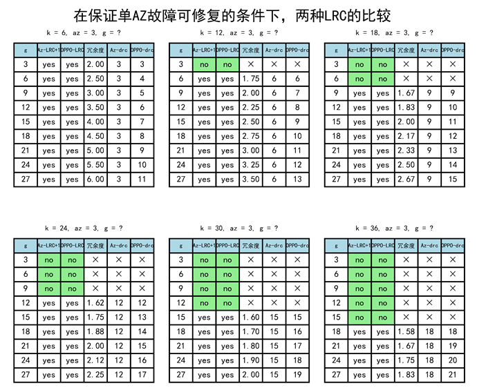
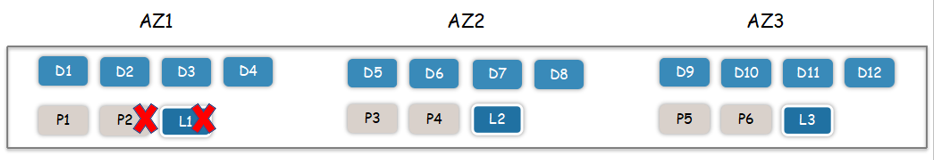
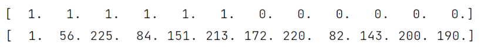
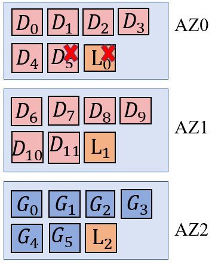

# 一、修复

# 1. 问题描述与分析

## 1.1. cubefs正在使用的编码模式

- **1AZ场景：**RS(10, 4)，冗余度为1.4， 对比三副本节约一半以上的存储成本，并且可以提供大于99.999999999%的数据耐久度。

- **3AZ场景：**

  -  RS(15, 9) ， 当某个AZ数据完全损坏，剩余16份数据可以正常恢复数据，且还能额外允许1块磁盘损坏 。

  

  -  LRC(12, 9, 3)，在AZ故障后可以额外允许任意2份数据损坏，但是其存储冗余度是2.0相对较高。

  

  -  LRC(12, 6, 3)，AZ故障后额外允许任意1块磁盘损坏，存储冗余度1.75。

  

## 1.2. cubefs编码模式面临的问题

​		RS编码，即使是单块修复也会引起大量的跨AZ流量。为了解决这个问题，cubefs实现了LRC编码，以减少单块修复的跨AZ流量。具体的做法是：先基于RS编码生成全局校验块，然后将全局校验块和数据块均匀放置到每个AZ，最后在每个AZ内部额外生成1个局部校验块。我们将cubefs的这种LRC编码策略称作OPPO_LRC。OPPO_LRC成功将单块修复的跨AZ流量降为0，但仍存在一些问题。

- （1）多块修复时，需要从每个AZ读取**原始**的数据块和全局校验块，跨AZ流量非常大。
- （2）局部校验块无法参与多块修复流程，因而产生额外的单块修复操作。例如某AZ内，损坏了两个数据块和一个局部校验块，OPPO_LRC需要一次多块修复操作和一次单块修复操作才能修复所有的损坏的块。
- （3）当AZ的数量、k、l、g等参数变化时，OPPO_LRC平均分配的放置方式不一定能确保容错下限。
- （4）当数据块更新时，所有的全局校验块也需要更新，而OPPO_LRC的全局校验块分散在所有的AZ中，更新操作会产生大量的跨AZ流量。

# 2. 解决思路

## 2.1. 基本思路

- 对问题（1），可以采用partial decoding策略解决，在跨AZ传输数据块或校验块以前，提前进行一定计算，减少跨AZ传输的数据量。
- 对问题（2），可以使用Azure_LRC编码模式，在修复过程中，Azure_LRC将局部校验块和全局校验块一视同仁，一次多块修复操作就可以修复所有损坏的块。

- 对问题（3），论文[1]针对Azure_LRC提出了在保证一定容错性前提下的最优放置方案。
- 对问题（4），可以尝试将所有的全局校验块放在同一个AZ中。
- 基于基本思路，可以得到图1.1所示的编码和放置策略。相应的编码矩阵设计在**矩阵设计文档**中有详细描述。

图1.1 Azure_LRC

## 2.2. 思路完善

- **容错能力要求：保证单AZ故障外加一个块故障可修复。**
- 显然，图1.1中的Azure_LRC不满足容错能力要求，且单全局校验块的修复会产生跨AZ流量。
- 为了解决该问题，只需要利用所有的全局校验块再生成一个局部校验块，该局部校验块需要和全局校验块放在同一个AZ中，得到图2.2所示的编码和放置策略，称之为Azure_LRC+1。
- 图2.2所示的编码和放置方案，满足了容错能力要求，也保证了所有的单块修复跨AZ流量是最低的。

图1.2 Azure_LRC+1

## 2.3. 对比OPPO_LRC与Azure_LRC+1的冗余度

- 我们需要确保，在不同参数下，当OPPO_LRC与Azure_LRC+1的容错能力相同时，两者的冗余度也不应该相差过大。
- 假设OPPO_LRC和Azure_LRC+1都使用了最完美的编码矩阵（即满足**矩阵设计文档**中提到的MR性质），且假设在3AZ场景下（cubefs只关注3AZ场景），在保证单AZ故障可修复外加一个块可修复的前提下，对OPPO_LRC与Azure_LRC+1做了比较，结果如图1.3所示。
- 从图1.3可以看到，**在满足容错下限的情况下，两种LRC的冗余度是完全一致的**。

图1.3 OPPO_LRC与Azure_LRC+1

# 3. 具体方案

​		虽然cubefs只关注3AZ场景，但我们还是给出了general parameter的方案。OPPO_LRC的放置策略并不适用于general parameter，因为它将AZ的数量与参数l绑定，当参数g过小的时候，它无法保证容错能力要求。

## 3.1. 编码模式和放置策略

- 编码模式：首先根据编码参数k、l、g精心设计编码矩阵，然后按照Azure_LRC的编码模式同时生成局部校验块和全局校验块（相应的编码矩阵设计在**矩阵设计文档**中有详细描述），最后将所有的全局校验块异或，得到一个额外的局部校验块。
- 放置策略：
  - 数据块组表示若干数据块及其对应的局部校验块，b表示一个数据块组中数据块的数量。
  - 针对数据块组：
    - 当b ≤ g时，按论文[1]的策略放置数据块和相应的局部校验块。
    - 当b > g时，对每个数据块组，以g个块为单位放到不同的AZ中。
  - 将所有的全局校验块以及对应的局部校验块单独放到一个AZ中，如图1.2所示。

## 3.2. 基于partial decoding的多块修复流程

- 如图1.4所示的错误模式。如果采用的是OPPO_LRC且不使用partial decoding策略，需要先进行一次多块修复操作以修复数据块D5，接着还要进行一次单块修复操作以修复L0，期间一共**产生了11个块的跨节点流量（单块修复会产生6个块的跨节点流量）和7个块的跨AZ流量**。

图1.4 OPPO_LRC错误模式举例

- 类似的，如图1.5所示，当Azure_LRC+1出现同样的错误模式，我们采用partial decoding策略来修复它：

  - 从编码矩阵中挑选合适的两行，这两行必须线性无关。其中一行是计算L0的式子，因为L0损坏了，必须借此来修复L0。另一行则是计算某个全局校验块的式子，假设是计算G1的式子。

  

  - 这两行其实就是两个方程，可以通过一定变换，可以将所有损坏的块放在方程的左边，所有存活的块放在方程的右边，以方便后续的修复操作。
  - 现在要做的就是读取存活块，计算并解这两个方程即可。需要读取D0~D4、D6~D11、G1。
  - 解方程所需的一些计算，可以在跨AZ传输之前完成，也可以在跨AZ传输之后完成：
    - 对于AZ1中的D6~D11，其提前计算后，需要跨AZ传输2个块（2个方程），小于原来的6个块，故提前计算。
    - 对于AZ2中的G1，其提前计算后，也需要跨AZ传输2个块（2个方程），多于原来的1个块，故推迟计算。
  - 在得到所需的块后，即可解方程求出损坏的块，整个过程**产生了5个块的跨节点流量和3个块的跨AZ流量**。

图1.4 Azure_LRC+1错误模式举例

# 二、小文件
# 三、更新